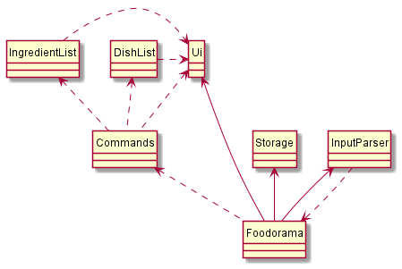
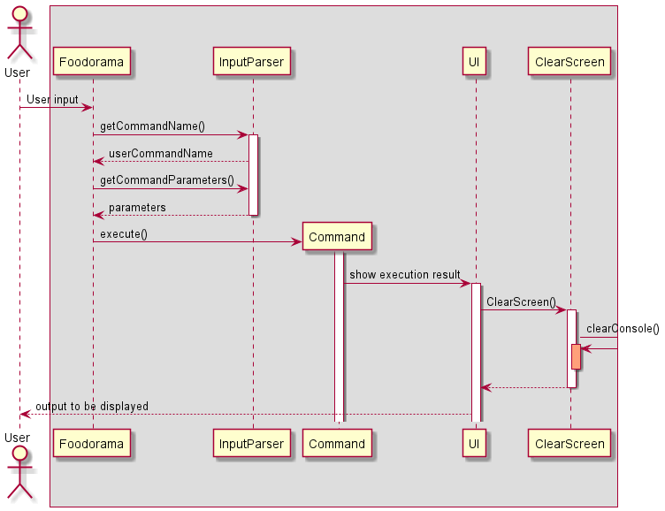
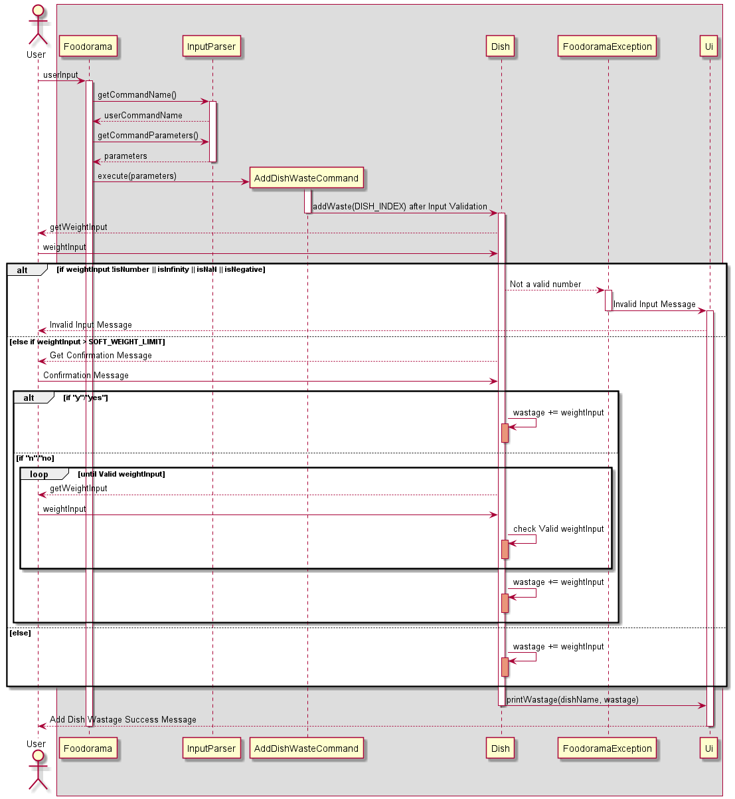
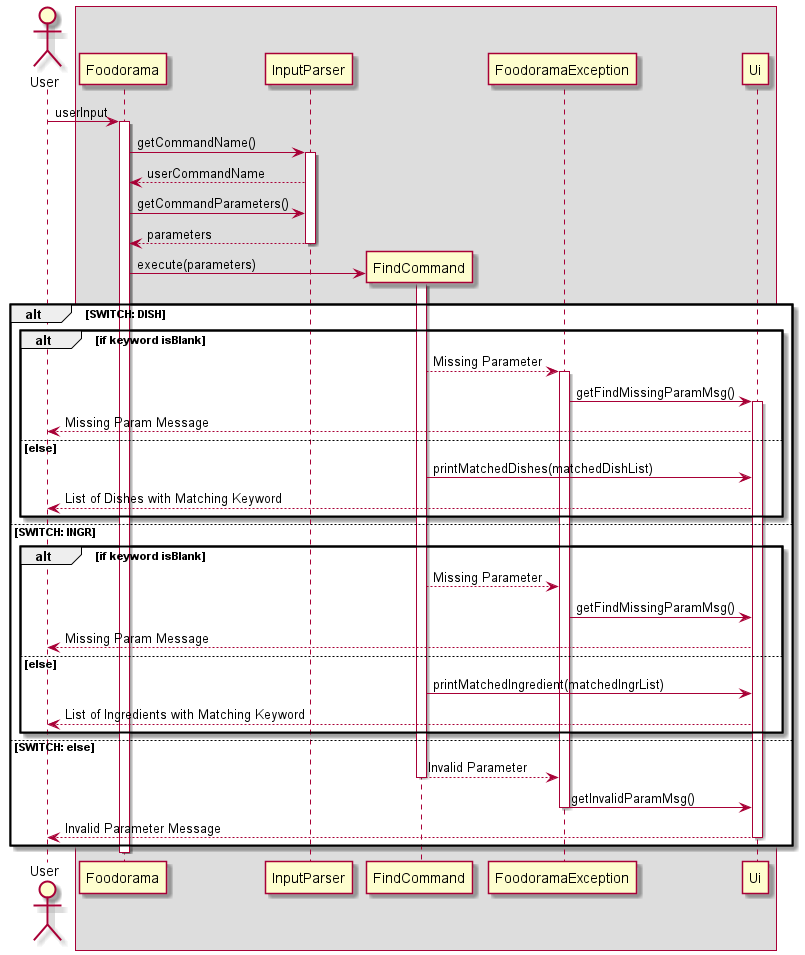
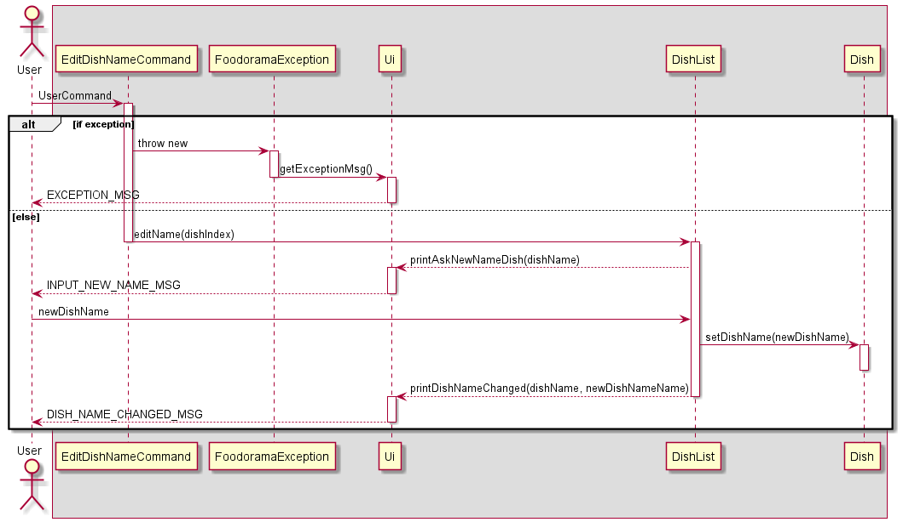
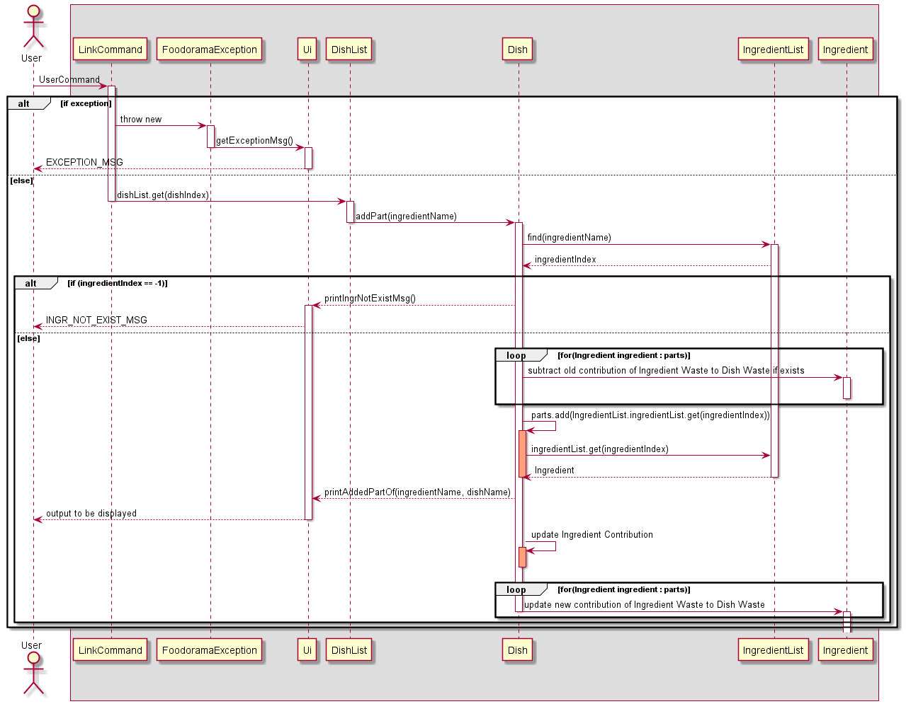
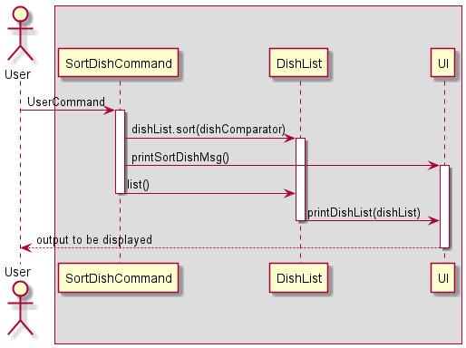

# Food-O-Rama Developer Guide

## 🌑 Introduction

*Food-O-Rama* is a Java based Command-Line-Interface (CLI) application.

This Developer Guide serves to inform developers on the design and implementation of
*Food-O-Rama* to assist them in the development process of APIs. It also helps them realise the target user profile that
motivated us to build this application.

| Legend |  Description |
| --- | --- |
| 💡 *Note*  | Lightbulb requires your attention. |

## 🧾 Table of Contents

* [Acknowledgements](#-acknowledgements)
* [Setting Up & Getting Started](#-setting-up--getting-started)
* [Design & Implementations](#-design--implementation)
    * [Design](#design)
        * [Main Components](#main-components)
        * [General Flow](#general-flow)
        * [Input Parsing](#input-parsing)
        * [Storage](#storage)
        * [Data Structures](#data-structures)
        * [User-Interface Component](#user-interface-component)
        * [Exceptions](#exceptions)
        * [Command Abstraction](#command-abstraction)
        * [Input Validation](#input-validation)
    * [Implementation](#implementation)
        * [Edit](#edit)
        * [Graph](#graph)
* [Product Scope](#-product-scope)
    * [Target User Profile](#target-user-profile)
    * [Value Proposition](#value-proposition)
* [User Stories](#-user-stories)
* [Non-Functional Requirements](#-non-functional-requirements)
* [Glossary](#-glossary)
* [Instructions for Manual Testing](#-instructions-for-manual-testing)

## 👍 Acknowledgements

* [AddressBook Level-3](https://se-education.org/addressbook-level3/) for User Guide and Developer Guide reference.
* [PlantUML](https://plantuml.com/) for creation of UML diagrams.
* [Java-Clear-Console](https://www.delftstack.com/howto/java/java-clear-console/) for reference on clearing terminal.

## ⭐ Setting Up & Getting Started

1. Fork *Food-O-Rama*'s repository from [here](https://github.com/AY2122S1-CS2113T-W11-4/tp).
2. Clone the repository into your computer.
3. Import the project into your IDE.
4. For optimal results, it is recommended to use JDK 11.

## 📔 Design

This section brings developers through the general flow of the programme, and the various components involved.

### Main Components

This section describes the overall design architecture of *Food-O-Rama*.

The `Main` class is responsible for initializing the main components upon start-up of the application, and deciding the
execution path of the application through the main components based on reading the user inputs.

The application consists of the following main components responsible for the high-level execution of a user input:

1. `Foodorama`: Initializes all the other components and coordinates them.
2. `Ui`: Handles the displaying of all command results and error messages to the user.
3. `Storage`: Handles the creation, reading from and writing from the `/data` directory
4. `InputParser`: Makes sense from the user input and decides which `Command` class to call.
5. `DishList`: Handles the collection of Dish objects used by Food-O-Rama
6. `IngredientList`: Handles the collection of Ingredient objects used by Food-O-Rama.
7. `Command`: Collection of classes that handle the different user commands

The architecture diagram below shows a high-level overview of the structure between different components.



### General Flow

Describes the step-by-step sequence from User Input to the Output.



1. User is greeted by welcome screen.
2. User begins typing inputs.
3. Inputs get parsed by InputParser returning the appropriate type of command and respective parameters.
4. Command gets executed and respective output gets displayed.
5. Once user is done using the application, he can send an exit message prompting a goodbye message.
6. Application exits.

### Input Parsing

The `InputParser` class is responsible for deconstructing User Inputs to identify Commands and Parameters for execution.


1. Gets command name of user input by checking if the users input starts with any of the strings that are defined for
  commands (add dish, list dish, help etc.).
2. Throws an exception if no matching command is found.
3. Takes rest of user input as parameterString.
4. Based on command name splits the parameterString into respective parameters to respective command classes for
  execution.

### Storage

The `Storage` class is responsible for the reading and writing of *Food-O-Rama* data. Data is stored as .txt files
under *'Data'* folder.

* After every operation writes the names of the Ingredient, weight of Ingredient Stored and weight of Ingredient Wasted,
  into a text file called `ingredients.txt`.
* After every operation writes the names of the Dish, weight of Dish Waste and constituents of the Dish if there are
  any, into a text file called `dishes.txt`.

#### Loading Data


1. At the start of the program, Duke calls `Storage.load()`
    * This method in the `Storage` class is responsible for invoking `loadIngredients()`, `loadDishes()`
      and `loadFormat()`
2. After accessing `ingredients.txt`, `ingredientList.add()` is called for every ingredient that exists in the list and
  is added to the active ArrayList, `IngredientList.ingredientList`
3. Then, after accessing `dishes.txt`, `dishList.add()` is called for every dish that exists in the list and is added to
  the active ArrayList, `DishList.dishList`
4. Any inputs in the data file that are invalid get disregarded and only valid inputs get loaded. As a result the invalid
  inputs get sanitized once Food-O-Rama is started
5. Finally, the method also sets up the `formats.txt` file that contains all the relevant formats in which the data is
  saved along with examples
    * This is present in the load method as opposed to the write method as it only needs to be called once per run of *
      Food-O-Rama*

💡 *Note: `dishes.txt`,`ingredients.txt` and `formats.txt` can be found in the `data` folder from the root directory.*

#### Saving Data


* After every command, Duke calls `Storage.write(Ingredient)`, then `Storage.write(Dish)`.
    * This method in the `Storage` class is responsible for writing to the respective text file depending on the mode.
* `Storage.write()` will access the respective text file and save to its respective save format.

* 💡 **Save Formats:**
    * Dishes
        * `DISH_NAME | DISH_WASTAGE | DISH_WASTAGE / NUM_OF_LINKED_INGREDIENTS | LIMIT | INGREDIENTS_LINKED`
        * Limit is `-1` if limit has not been defined.
        * `DISH_WASTAGE/NUM_OF_LINKED_INGREDIENTS` is `DISH_WASTAGE` if no ingredients have been linked.
    * Ingredients
        * `INGREDIENT_NAME | INGREDIENT_STORAGE | INGREDIENT_WASTAGE | LIMIT | EXPIRY`
        * Limit is `-1` if limit has not been defined.
        * Expiry is `null` if expiry has not been defined.

### Data Structures

The `Dish`, `DishList`, `Ingredient` and `IngredientList` classes are responsible for the handling and manipulation of
the *Food-O-Rama* data.


* The `Dish` class contains the Dish's Name, its wastage and its constituents.
* The `Ingredient` class contains the Ingredient's Name, the weight of Ingredient in storage, the weight of Ingredient
  wasted as well as the weight of Ingredient wasted from Dish wastage.
* The `DishList` class comprises an array of `Dish` along with functions to find, retrieve and modify dishes.
* The `IngredientList` class comprises an array of `Ingredient` along with functions to find, retrieve and modify
  ingredients.
    * The Sort function arranges Dishes / Ingredients in descending order of their wastage.
    * The Graph function visualises the wastage of Dishes / Ingredients for easier analysis.

### User-Interface Component

The `Ui` Class is responsible for the printing of interactive messages whenever a user types an input. It handles print
messages to the Command Line Interface from when the program loads, to after every input by the user and finally when
the user exits the program.

The below class diagram shows the structure and relations of the Ui class in Foodorama.


For simplicity’s sake the ui class has been minimized into 3 components:

* The strings containing the various messages
* Functions that get a string from UI to be used elsewhere (e.g. Exception classes getting error messages)
* Functions that print command outputs

### Exceptions

The `FoodoramaException` class is responsible for handling errors such as unrecognised user commands and improper
parameters. It does so by calling the `Ui` class to provide the error messages and throwing the exception up to the
highest level, that is the Foodorama class where it then gets caught and the message is printed with the
exception.getMessage() method which is part of the base Exception class.

### Command Abstraction


* Different Command Classes that perform different tasks by calling various functions of the Object Classes.
* All inherit from an abstract `Command` class with one execute method that takes an Arraylist<String> as input.
* These command classes help perform a more specialized input validation so ensure the inputs match the specific command
  that has been invoked

### Input validation

In addition to the input parser, due to the different types of inputs Food-O-Rama deals with, there exists a second round
of input validation to help seperate the invalid inputs from those that are valid

The sequence diagram for the validation of Numerical Inputs is given below


As you can see the system filters out the numerical inputs from the text strings and chceks if the numerical inputs are
integers or not providing the actual methods that do the computation the only valid inputs that are integers in thsi
case. The same process can be done to include doubles as well by excluding the final integer check.

The sequence diagram for the validation of Text strings is given below


The process of input validation for strings is quite similar to that for integers except the roles are reversed

## ✍ Implementation
This section explores the overall implementation of the different main functions and how they work.

### Add

The add command allows for the addition of dishes and ingredients, and wastage weights and storage weights.

#### Adding Dishes and Ingredients

The `add dish` and `add ingr` commands are handled by the `AddDishCommand` and `AddIngrCommand` classes respectively.
Both commands have a similar implementation, with the difference being that `add ingr` has an additional weight input as
further described in the sequence diagram below.


For `add dish` and `add ingr` commands:

1. `AddDishCommand` or `AddIngredientCommand` will proceed with basic Input Validation, and
   call `TYPEList.add[DISH/INGR_NAME]`, where `TYPE` is either `Dish` or `Ingredient` respectively.

        For Adding Dishes, skip to Step 6.

2. For Adding Ingredients, `IngredientList.add()` will prompt storage weight input of the Ingredient from the user and
   throw exceptions if the storage weight is not an integer, is `Infinity` is `NaN`, or is negative.

3. If storage weight input is greater than 10000kg (*soft limit*), the user will be prompted with a confirmation
   message.

4. If the user enters `n` or `no`, the input weight prompt will loop until the user inputs a valid number.

5. Else, the ingredient is added to the ingredient list.

6. Dishes will be added to the dish list without the prompt for storage weight input.

7. The Ui class is then called to print a success message to the user.

#### Adding Wastage to Dishes and Ingredients, Storage to Ingredients

The `add dish waste`, `add ingr waste` and `add ingr storage` commands are handled by the `AddDishWasteCommand`
, `AddIngrWasteCommand` and `AddIngrStoredCommand` classes respectively. All three commands have similar implementation
as described by the sequence diagram below for Adding Wastage to Dishes.



For `add dish waste`, `add ingr waste` and `add ingr stored` commands:

1. The input will be handled by their respective command classes with Basic Input Validation and call the `Dish`
   or `List`
   class methods `addWeight` (for waste) or `updateIngredientStoredWeight` (for ingredient stored.)

2. The methods will prompt weight input from the user and throw exceptions if the weight is not an integer,
   is `Infinity`, is `NaN` or is negative.

3. If weight input is greater than 10000kg (*soft limit*), the user will be prompted with a confirmation message.

4. If the user enters `n` or `no`, the input weight prompt will loop until the user inputs a valid number.

5. Else, the weight input is added to the dish/ingredient wastage or ingredient storage.

6. The Ui class is then called to print a success message to the user.

The difference between the three commands lies in the `add dish waste` command, where the wastage must be added to the
ingredients linked to it as seen in the Code Snippet below.

Code Snippet:

```
    if (!parts.isEmpty()) {
        ingredientContribution = wastage / parts.size();
        for (Ingredient ingredient : parts) {
            // Change in contribution is change in wastage / num of parts
            ingredient.addDishWaste(inputWastage / parts.size());
        }
    }
```

### Find

The find commands (`find dish` and `find ingr`) implement the `FindCommand` class to allow the user to search for a
particular `KEYWORD` and return a list of Dishes or Ingredients that match the keyword.



For `find` commands, the handling method `FindCommand.execute()`:

1. Parses the input and determines if a dish or ingredient is to be found, and uses corresponding switch cases. If it is
   neither, throw an Invalid Parameter error via FoodoramaException.

2. If the keyword to be found is blank, throw a Missing Parameter error via FoodoramaException.

3. Else, checks if the input keyword exists in the name of every Dish or Ingredient in their respective list classes.

4. Stores all Dishes or Ingredients with a matching name in a new ArrayList.

5. Calls the Ui class to print the new ArrayList to the user.

### Edit

The implementation of the Edit function allows the User to edit several instance variables of the Dishes and Ingredients
present in the DishList and IngredientList.



This Sequence Diagram shows how the `EditDishNameCommand` class functions.

Currently the User is able to edit the following:

* Dish Name
* Dish Wastage Weight
* Ingr Name
* Ingr Wastage Weight
* Ingr Storage Weight

The remaining Edit classes, namely `EditDishWasteCommand`, `EditIngrNameCommand`,
`EditIngrStoredCommand` and `EditIngrWasteCommand` follow sequences similar to the one shown above in their
implementation.

### Set

The implementation of the set function allows the User to set the expiry date for ingredients

Below is a sequence diagram that shows how the SetExpiryCommand functions


1. The input will be handled by the basic input validation within the command class to figure out which ingredient is to be changed

2. The methods will prompt a date input as a sting and will throw exceptions if date is of an invalid format.

3. If the input is a valid date, the function will calculate the days till expiry. If this result turns out to be negative (in the past), the user is prompted to re-enter a date

4. There is currently a soft limit of 10000 days for the expiry. If this limit is exceeded the user will be prompted for confirmation before proceeding as 10000 is an unusual amount for the field and might be a misinput.

5. If the user enters `n` or `no`, the user is prompted to re-enter a date.

6. Else, the previously entered date is set as the expiry.

7. The Ui class is then called to print a success message to the user.

### Link

The Link function allows Users to link existing Ingredients in the IngredientList to the existing Dishes in the DishList
that use them. The diagram below showcases the sequence of the `LinkCommand` class.



1. The LinkCommand calls upon DishList to get the Dish based on the Index given via UserInput
2. DishList then calls on Dish to carry out the addPart(ingredientName) function which is responsible for the linking of
  the Dish and Ingredient
3. Dish calls on IngredientList through the find function, to which IngredientList returns the Index of the Ingredient
4. Given the index is non-negative, the addPart function then removes any old contributions of Ingredient Wastes in the
  current Dish's Waste through a loop
5. Subsequently, it adds the Ingredient to the Dish's parts following which it updates the Dish's own Ingredient
  Contribution
6. Finally, the function re-updates the contribution of all linked Ingredient's Wastes to the Dish's Waste.

### Graph

The implementation of the Graph function allows Food-O-Rama to display a graph of the Dishes and Ingredients present in the
DishList and IngredientList to the User.
Below is a sequence diagram that shows how the GraphCommand functions


Graph works by creating a 2d grid and printing the bars based on the current position of the terminal cursor. This lets
us bypass the restriction in a CLI based application where you can only print from up to down and the bars can get
printed "vertically". This is done by calculating the lengths of the bars beforehand and using these lengths along with
the current coordinates to print either an empty space or a bar.

Despite this due to CLI and ascii limitations, printing of fractional values posed an issue. This was because you are
unable to print half a character and using special unicode characters would break cross-platform functionality. The
solution that we implemented was to have a digit in the top most bar if we have fractional heights. This way while we
still don't get a perfect representation, we are capable of giving the value accurate to one decimal place. So if the
height was 3.33 units it would be represented by 3 filled bars and the 4th bar will have a 3 within indicating its value
is between 3.3 to 3.4 as shown in the figure below.

```
____________________________________________________________

                           [|]     Legend:              Scale: 1 unit = 5.0kg
                           [|]     A. chicken: 2.56kg
                           [|]     B. rice: 21.56kg
                           [|]     C. flour: 24.56kg
                     [3]   [|]     D. potato: 26.56kg
         [3]   [9]   [|]   [|]     E. corn: 50.0kg
         [|]   [|]   [|]   [|]
         [|]   [|]   [|]   [|]
         [|]   [|]   [|]   [|]
    [5]  [|]   [|]   [|]   [|]
     A    B     C     D     E

____________________________________________________________
```

### Random dish

The `RandomDishCommand` class is used to generate a random Dish Name.

The random Dish Name is a combination of Strings from 4 different ArrayLists.

These ArrayLists are carbohydrates, proteins, sauces and cookingMethods. The ArrayLists contain a fixed pool of
vocabulary.

Code Snippet:

```
ArrayList<String> carbohydrates = new ArrayList<>() {
        {
            add("rice");
            add("noodles");
            add("beans");
            add("potatoes");
            add("pizza");
            add("burger");
            add("pasta");
        }
    };

    ArrayList<String> proteins = new ArrayList<>() {
        {
            add("chicken");
            add("turkey");
            add("beef");
            add("pork");
            add("duck");
            add("lamb");
            add("fish");
            add("lobster");
        }
    };

    ArrayList<String> sauces = new ArrayList<>() {
        {
            add("chili");
            add("tomato");
            add("mustard");
            add("cheesy");
            add("soy sauce");
            add("mayonnaise");
            add("sweet");
        }
    };

    ArrayList<String> cookingMethods = new ArrayList<>() {
        {
            add("steamed");
            add("grilled");
            add("fried");
            add("baked");
            add("smoked");
            add("roasted");
        }
    };
```

Random Dish Name is then generated by taking a random String element from each of these 4 ArrayLists and adding a white
space between the Strings. The generated Dish Name is stored in the String variable `generatedDishName` to be printed to
the user.

Code Snippet:

```
        Ui UI = new Ui();

        Random randomMethod = new Random();

        int carbohydratesIndex = randomMethod.nextInt(carbohydrates.size());
        int proteinsIndex = randomMethod.nextInt(proteins.size());
        int saucesIndex = randomMethod.nextInt(sauces.size());
        int cookingMethodsIndex = randomMethod.nextInt(cookingMethods.size());

        String generatedDishName = cookingMethods.get(cookingMethodsIndex) + " "
                + sauces.get(saucesIndex) + " "
                + proteins.get(proteinsIndex) + " "
                + carbohydrates.get(carbohydratesIndex) + " ";

        this.randomDishName = generatedDishName;

        UI.printRandomDishName(generatedDishName);
```

This allows the user to generate new Dish ideas.

### Sort

The `SortDishCommand` and `SortIngrCommand` classes are used to sort the Dishes and Ingredients respectively, according
to their Wastages in descending order. This allows the user to view the most wasted Dishes and Ingredients at the top.




* The Sort functions work by calling on the pre-existing Comparator function in ArrayList. Using this, they sort the
  Dishes and Ingredients in descending order of their Wastages.
* Once done, the Sort Commands call on the list() function present in both DishList and IngredientList.
* The list() function calls upon the `Ui` class to print the list of Dishes or Ingredients via the printDishList(
  dishList) or printIngrList(ingredientList) functions.

### Terminal Refreshing / Clear Screen

The interface of the program utilizes the ClearScreen class to clear the terminal after every user input through the
built-in `ProcessBuilder` Java class. Such a feature allows greater readability and focus for the user as the terminal
will not be cluttered with past commands.
`Ui` will call `ClearScreen.clearConsole()` method to clear the terminal.

The ProcessBuilder class will send a respective command to the terminal depending on the Operating System of the user.
The command it sends to the terminal is as follows:

* `cls` for Windows CMD Terminals.
* `clear` for Linux/MacOS Terminals.

`ClearConsole()` Code Snippet:

```
 public static void clearConsole() {
        try {
            // Get current operating system
            String getOS = System.getProperty("os.name");

            if (getOS.contains("Windows")) {
                // Try clear for Windows
                // "/c" - execute string as command, "cls" -  Clear terminal
                ProcessBuilder pb = new ProcessBuilder("cmd", "/c", "cls");
                Process startProcess = pb.inheritIO().start();
                startProcess.waitFor();
            } else {
                // Try clear for MacOS/Linux
                // "clear" - Clear terminal
                ProcessBuilder pb = new ProcessBuilder("clear");
                Process startProcess = pb.inheritIO().start();
                startProcess.waitFor();
            }
        } catch (Exception e) {
            System.out.println(e);
        }
    }
```

## 📂 Product Scope

Provides Developers with insights into our intended customers and the background to the problem to which
*Food-O-Rama* finds a solution.

### Target User Profile

Restaurant owners who will delegate their Inventory Management to Managers who are fast typists with experience in using
the Command Line Interface.

### Value Proposition

By presenting the wastage statistics, we can help restaurant owners figure out which dishes are contributing the most to
wastage at the restaurant. This way, they can allocate their resources more efficiently to better doing dishes. Thus, we
are reducing time wastage due to cooking of excess dishes and also saving money from purchasing unnecessary ingredients.
Therefore, there’s a two-fold saving. Additionally, we are also contributing to reducing Singapore's contribution to    
global food wastage.

## 🎤 User Stories

Brings developers through the requirements of Users the *Food-O-Rama* team considered when building this programme.

| Version | As a ... | I want to ... | So that I can ... |
| -------- | ---------- | --------------- | ------------------ |
| v1.0 | Restaurant owner | Delete an entry for a particular dish | Change the tracking to adapt to a change in my menu |
| v1.0 | Restaurant owner | Use a help function | Get familiar with the application |
| v1.0 | Restaurant owner | Add an ingredient to be tracked | Keep track of the ingredient storage |
| v1.0 | Restaurant owner | Add a dish to be tracked | Track its wastage and its ingredients’ wastage |
| v1.0 | Restaurant owner | Add the weight of wastage of a dish | Know how much of a certain dish is being wasted |
| v1.0 | Restaurant owner | Calculate the Ingredients and Dishes wasted | Plan for future meal services to reduce food wastage |
| v2.0 | Restaurant owner | Find a particular Ingredient/Dish | Do not have to look through a long list of ingredients/dishes |
| v2.0 | Restaurant owner | Sort the Ingredients in descending order of Wastage | Determine which ingredients are wasted the most |
| v2.0 | Restaurant owner | Sort the Dishes in descending order of Wastage | Determine which dishes are wasted the most |
| v2.0 | Restaurant owner | Clear all the Dishes and/or Ingredients present in my data | Restart my data collection |
| v2.0 | Restaurant owner | View a graph of wastage for my Dishes and Ingredients | Understand the wastage trends of Dishes and Ingredients at a glance |
| v2.0 | Restaurant owner | Refresh my Command Line Interface after every User Command | Not have a cluttered terminal and instead focus on my tasks |
| v2.0 | Restaurant owner | Set limits for wastage | Get prompted when I waste too much as opposed to checking constantly |
| v2.1 | Restaurant owner | Edit my dishes | Fix my mistakes and not have to worry about perfectly inputting details all the time |
| v2.1 | Restaurant owner | Get a random dish name | Expand my collection of dishes |
| v2.1 | Restaurant owner | Set an expiry date for ingredients | Track if my ingredients are fresh |

## 🚦 Non-Functional Requirements

* *Work offline:* User should be able to use *Food-O-Rama* without the need for Internet Access.
* *Cross-platform:* *Food-O-Rama* should be able to run on Windows, macOS and Linux operating systems without crashing.
* *Exceptions handling:* *Food-O-Rama* should be able to handle exceptions caused by User keying in erroneous inputs
  without crashing.
* *Accessibility:* Users with the .jar file should be able to use *Food-O-Rama* .

## 📒 Glossary

* *Mainstream OS* - Windows, Linux, Unix, OS-X.
* *Ingredient* - The basic unit required to create any Dish.
* *Dish* - Food prepared using a combination of Ingredients.
* *Wastage* - Weight of Dish or Ingredient wasted.

## 🧪 Instructions for Manual Testing

* For Manual Testing, you can write sample data into data text files (`dishes.txt` & `ingredients.txt`).

Dish
Format: `[DISH_NAME] | [AMOUNT_WASTED_IN_KG] | [WASTAGE_DIVIDED_BY_NUM_OF_LINKED_INGR] | [WASTAGE_LIMIT] | [INGR_1|INGR_2|etc.]`

* 💡 *Note*: `[WASTAGE_LIMIT]` is `-1` when no limit is set.

Dish example of usage:

```
No Linked Ingredients, No Limit, Wastage of 2kg:
chicken rice|2.0|2.0|-1

2 Linked Ingredients (chicken and rice), Wastage of 2kg, No Limit:
chicken rice|2.0|1.0|-1|chicken|rice

2 Linked Ingredients (chicken and rice), Wastage of 2kg, Limit of 3kg:
chicken rice|2.0|1.0|3|chicken|rice
```

Ingredient Format: `[INGR_NAME] | [AMOUNT_STORED_IN_KG] | [AMOUNT_WASTED_IN_KG] | [WASTAGE_LIMIT] | [EXPIRY_DATE]`

* 💡 *Note*:

    * `[WASTAGE_LIMIT]` is `-1` when no limit is set.
    * `[EXPIRY_DATE]` follows the format `dd/MM/yyyy`.
    * `[EXPIRY_DATE]` is `null` when no expiry date is set.

Ingredient example of usage:

```
No Limit, No Expiry, Storage of 2kg, Wastage of 1kg:
duck|2.0|1.0|-1|null

Limit of 2.5kg, Expiry Set, Storage of 2kg, Wastage of 1kg:
duck|2.0|1.0|2.5|30/10/2021
```

### Testing the Dish commands

1. Add new Dish

    * Test case: `add dish chicken rice`

      Expected: Initially the Dish List is empty, one Dish `chicken rice` is added and a success message will be printed
      to the CLI.

    * Test case: `add dish 5`
    * Test case: `add dish 5.5`

      Expected: Name of Dish cannot be a number. An error message will be printed to the CLI, disregarding the invalid
      command.

    * Test case: `add dish chicken rice`

      Expected: Dish List already contains `chicken rice`. An error message will be printed to the CLI, disregarding the
      command.


2. Add the Dish Wastage

    * Test case:`add dish waste chicken rice`

      Expected: Dish List contains `chicken rice`. A message will be printed to the CLI to prompt user for the wastage
      weight of `chiccken rice` in kg.

    * Test case:`add dish waste 1`

      Expected: Dish List contains `chicken rice`, and `chicken rice` is at the first position in the Dish List. A
      message will be printed to the CLI to prompt user for the wastage weight of `chiccken rice` in kg.

    * Test case:`add dish waste abcde`

      Expected: Dish List does not contain `abcde`. An error message will be printed to the CLI to let user know
      that `abcde` does not exist in the Dish List. The command is disregarded.


3. Set a Limit for Dish Wastage

    * Test case:`set dish limit chicken`

      Expected: Dish List contains `chicken rice`. A message will be printed to the CLI to prompt user to enter the
      limit of wastage weight of `chiccken rice` in kg.

    * Test case:`set dish limit 1`

      Expected: Dish List contains `chicken rice` and `chicken rice` is at the first position in the Dish List. A
      message will be printed to the CLI to prompt user to enter the limit of wastage weight of `chiccken rice` in kg.

    * Test case:`set dish limit abcde`

      Expected: Dish List does not contain `abcde`. An error message will be printed to the CLI to let user know
      that `abcde` does not exist in the Dish List. The command is disregarded.


4. Edit a Dish's Name

    * Test case:`edit dish name chicken rice`

      Expected: Dish List contains `chicken rice`. A message will be printed to the CLI to prompt user to enter the new
      name for `chicken rice`.

    * Test case:`edit dish name 1`

      Expected: Dish List contains `chicken rice`, and `chicken rice` is at the first position in the Dish List. A
      message will be printed to the CLI to prompt user to enter the new name for `chiccken rice`.

    * Test case:`edit dish name abcde`

      Expected: Dish List does not contain `abcde`. An error message will be printed to the CLI to let user know
      that `abcde` does not exist in the Dish List. The command is disregarded.


5. Edit a Dish's Wastage

    * Test case:`edit dish waste chicken rice`

      Expected: Dish List contains `chicken rice`. A message will be printed to the CLI to prompt user to enter the new
      wastage weight for `chiccken rice`.

    * Test case:`edit dish waste 1`

      Expected: Dish List contains `chicken rice`, and `chicken rice` is at the first position in the Dish List. A
      message will be printed to the CLI to prompt user to enter the new wastage weight for `chiccken rice`.

    * Test case:`edit dish waste abcde`

      Expected: Dish List does not contain `abcde`. An error message will be printed to the CLI to let user know
      that `abcde` does not exist in the Dish List. The command is disregarded.


6. Delete existing Dish

    * Test case:`del dish chicken rice`

      Expected: Dish List contains `chicken rice`. A message will be printed to the CLI to ask user on confirming
      deletion for `chiccken rice`.

    * Test case:`del dish 1`

      Expected: Dish List contains `chicken rice`, and `chicken rice` is at the first position in the Dish List. A
      message will be printed to the CLI to ask user on confirming deletion for `chiccken rice`.

    * Test case:`del dish abcde`

      Expected: Dish List does not contain `abcde`. An error message will be printed to the CLI to let user know
      that `abcde` does not exist in the Dish List. The command is disregarded.


7. View Existing Dishes

    * Test case: `list dish` but no Dish added to the Dish List in the first place.

      Expected: An empty list of existing Dishes with message to tell user to add Dishes will be printed onto the CLI.

    * Test case: `list dish`

      Expected: A list of existing Dishes will be printed onto the CLI.


8. Generate a random Dish Name

    * Test case: `rdish`

      Expected: A random name for a Dish will be printed onto the CLI. e.g. `roasted chili fish potatoes`

### Testing the Ingredient commands

1. Add new Ingredient

    * Test case: `add ingr duck`

      Expected: Initially the Ingredient List is empty, One Ingredient `duck` is added and a message will be printed to
      the CLI to prompt user for the weight of `duck` in kg. Upon entering a valid weight, e.g. `5`or `5.5`, a success
      message will be printed to the CLI. Upon entering an invalid weight that is not a number, e.g. `abc`, an error
      message will be printed to the CLI, disregarding the invalid command.

    * Test case: `add ingr 5`
    * Test case: `add ingr 5.5`
      Expected: Name of Ingredient cannot be a number. An error message will be printed to the CLI, disregarding the
      invalid command.

    * Test case: `add ingr duck`
      Expected: Ingredient List already contains `duck`. An error message will be printed to the CLI, disregarding the
      command.


2. Add Storage to an existing Ingredient

    * Test case: `add ingr stored duck`
      Expected: Ingredient List contains `duck`. A message will be printed to the CLI to prompt user for the additional
      storage weight of `duck` in kg.

    * Test case: `add ingr stored 1`
      Expected: Ingredient List contains `duck` and `duck` is at the first position in the Ingredient List. A message
      will be printed to the CLI to prompt user for the additional storage weight of `duck` in kg.

    * Test case: `add ingr stored lmnop`
      Expected: Ingredient List does not contain `lmnop`. An error message will be printed to the CLI to let user know
      that `lmnop` does not exist in the Ingredient List. The command is disregarded.


3. Add the Ingredient Wastage

    * Test case: `add ingr waste duck`
      Expected: Ingredient List contains `duck`. A message will be printed to the CLI to prompt user for the wastage
      weight of `duck` in kg.

    * Test case: `add ingr waste 1`
      Expected: Ingredient List contains `duck` and `duck` is at the first position in the Ingredient List. A message
      will be printed to the CLI to prompt user for the wastage weight of `duck` in kg.

    * Test case: `add ingr waste lmnop`
      Expected: Ingredient List does not contain `lmnop`. An error message will be printed to the CLI to let user know
      that `lmnop` does not exist in the Ingredient List. The command is disregarded.


4. Set a Limit for Ingredient Stored

    * Test case:`set ingr limit duck`

      Expected: Ingredient List contains `duck`. A message will be printed to the CLI to prompt user to enter the limit
      of storage weight of `duck` in kg.

    * Test case:`set ingr limit 1`

      Expected: Ingredient List contains `duck` and `duck` is at the first position in the Ingredient List. A message
      will be printed to the CLI to prompt user to enter the limit of storage weight of `duck` in kg.

    * Test case:`set ingr limit lmnop`

      Expected: Ingredient List does not contain `lmnop`. An error message will be printed to the CLI to let user know
      that `lmnop` does not exist in the Ingredient List. The command is disregarded.


5. Set an Expiry Date for an existing Ingredient

    * Test case:`set ingr expiry duck`

      Expected: Ingredient List contains `duck`. A message will be printed to the CLI to prompt user for the expiry date
      of `duck` in 'dd/MM/yyyy' format. Upon entering a valid expiry date, e.g. `08/11/2021`, a success message will be
      printed to the CLI. Upon entering an invalid date that does not follow 'dd/MM/yyyy', e.g. `abc`, an error message
      will be printed to the CLI, until the user enters a date in 'dd/MM/yyyy' format.

    * Test case:`set ingr expiry 1`

      Expected: Ingredient List contains `duck` and `duck` is at the first position in the Ingredient List. A message
      will be printed to the CLI to prompt user for the expiry date of `duck` in 'dd/MM/yyyy' format. Upon entering a
      valid expiry date, e.g. `08/11/2021`, a success message will be printed to the CLI. Upon entering an invalid date
      that does not follow 'dd/MM/yyyy', e.g. `abc`, an error message will be printed to the CLI, until the user enters
      a date in 'dd/MM/yyyy' format.

    * Test case:`set ingr expiry lmnop`

      Expected: Ingredient List does not contain `lmnop`. An error message will be printed to the CLI to let user know
      that `lmnop` does not exist in the Ingredient List. The command is disregarded.


6. Edit an Ingredient's Name

    * Test case:`edit ingr name duck`

      Expected: Ingredient List contains `duck`. A message will be printed to the CLI to prompt user for the new
      Ingredient Name of `duck`.

    * Test case:`edit ingr name 1`

      Expected: Ingredient List contains `duck` and `duck` is at the first position in the Ingredient List. A message
      will be printed to the CLI to prompt user for the new Ingredient Name of `duck`.

    * Test case:`edit ingr name lmnop`

      Expected: Ingredient List does not contain `lmnop`. An error message will be printed to the CLI to let user know
      that `lmnop` does not exist in the Ingredient List. The command is disregarded.


7. Edit an Ingredient's Storage

    * Test case:`edit ingr stored duck`

      Expected: Ingredient List contains `duck`. A message will be printed to the CLI to prompt user for the new storage
      weight of `duck`.

    * Test case:`edit ingr stored 1`

      Expected: Ingredient List contains `duck` and `duck` is at the first position in the Ingredient List. A message
      will be printed to the CLI to prompt user for the new storage weight of `duck`.

    * Test case:`edit ingr stored lmnop`

      Expected: Ingredient List does not contain `lmnop`. An error message will be printed to the CLI to let user know
      that `lmnop` does not exist in the Ingredient List. The command is disregarded.


8. Edit an Ingredient's Wastage

    * Test case:`edit ingr waste duck`

      Expected: Ingredient List contains `duck`. A message will be printed to the CLI to prompt user for the new wastage
      weight of `duck`.

    * Test case:`edit ingr waste 1`

      Expected: Ingredient List contains `duck` and `duck` is at the first position in the Ingredient List. A message
      will be printed to the CLI to prompt user for the new wastage weight of `duck`.

    * Test case:`edit ingr waste lmnop`

      Expected: Ingredient List does not contain `lmnop`. An error message will be printed to the CLI to let user know
      that `lmnop` does not exist in the Ingredient List. The command is disregarded.


9. Link a Dish with an Ingredient

    * Dish Index and Ingredient Index do not work here. i.e. Numbers don't work for `link` command.
    * Test case:`link chiken rice / duck`

      Expected: Dish List contains `chicken rice`. Ingredient List contains `duck`. A success message will be printed to
      the CLI to inform user that `duck` has been associated with `chicken rice`.

    * Test case:`link chiken rice / lmnop`

      Expected: Dish List contains `chicken rice`. Ingredient List does not contain `lmnop`. An error message will be
      printed to the CLI to let user know that `lmnop` does not exist in the Ingredient List. The command is
      disregarded.

    * Test case:`link abcde / duck`

      Expected: Dish List does not contain `abcde`. Ingredient List contains `duck`. An error message will be printed to
      the CLI to let user know that `abcde` does not exist in the Dish List. The command is disregarded.


10. Delete an existing Ingredient

    * Test case:`del ingr duck`

      Expected: Ingredient List List contains `duck`. A message will be printed to the CLI to ask user on confirming
      deletion for `duck`.

    * Test case:`del ingr 1`

      Expected: Ingredient List contains `duck`, and `duck` is at the first position in the Ingredient List. A message
      will be printed to the CLI to ask user on confirming deletion for `duck`.

    * Test case:`del ingr lmnop`

      Expected: Ingredient List does not contain `abcde`. An error message will be printed to the CLI to let user know
      that `lmnop` does not exist in the Ingredient List. The command is disregarded.


11. View Existing Ingredients

    * Test case: `list ingr` but no Ingredient added to the Ingredient List in the first place.

      Expected: An empty list of existing Ingredients with message to tell user to add Ingredients will be printed onto
      the CLI.

    * Test case: `list ingr`

      Expected: A list of existing Ingredients will be printed onto the CLI.

### Testing the Graph commands

1. Display Graph of Dish Wastage

    * Test case: `graph dish` but no Dish added to the Dish List in the first place.

    * Expected: A message will be printed to the CLI to let user know that the Dish List is empty. There is nothing to
      show.

    * Test case: `graph dish`

    * Expected: A graph of existing Dishes will be printed onto the CLI.


3. Display Graph of Ingredient Wastage

    * Test case: `graph ingr` but no Ingredient added to the Ingredient List in the first place.

    * Expected: A message will be printed to the CLI to let user know that the Ingredient List is empty. There is
      nothing to show.

    * Test case: `graph ingr`

    * Expected: A graph of existing Ingredients will be printed onto the CLI.

### Testing the Find commands

1. Find a Dish

    * Test case: `find dish [keyword]` but no Dish added to the Dish List in the first place.

    * Expected: A message will be printed to the CLI to let user know that the Dish List is empty. The keyword cannot
      find anything.

    * Test case: `find dish [keyword]`

    * Expected: A list of existing Dishes that matches `[keyword]` will be printed onto the CLI.


2. Find a Ingredient

    * Test case: `find ingr [keyword]` but no Dish added to the Dish List in the first place.

    * Expected: A message will be printed to the CLI to let user know that the Ingredient List is empty. The keyword
      cannot find anything.

    * Test case: `find ingr [keyword]`

    * Expected: A list of existing Ingredients that matches `[keyword]` will be printed onto the CLI.

### Testing the Clear commands

1. Remove all Dishes

    * Test case: `clear dish`

    * Expected: A message will be printed to the CLI to ask user on confirming deletion of all Dishes from the Dish
      List.


2. Remove all Ingredients

    * Test case: `clear ingr`

    * Expected: A message will be printed to the CLI to ask user on confirming deletion of all Ingredients from
      Ingredient List.


3. Remove all Dishes and Ingredients

    * Test case: `clear all`

    * Expected: A message will be printed to the CLI to ask user on confirming deletion of all Dishes from Dish List and
      all Ingredients from Ingredient List.

### Testing the Sort Commands

1. Sort the Dishes by amount of wastage

    * Test case: `sort dish` but no Dish added to the Dish List in the first place.

      Expected: An empty list of Dishes with message to tell user to add Dishes will be printed onto the CLI.

    * Test case: `sort dish`

      Expected: All existing Dishes in the Dish List will be sorted from having the most weight wastage to the least
      weight wastage. A sorted list of existing Dishes will be printed onto the CLI.


2. Sort the Ingredients by amount of wastage

    * Test case: `sort ingr` but no Ingredients added to the Ingredient List in the first place.

      Expected: An empty list of Ingredients with message to tell user to add Ingredients will be printed onto the CLI.

    * Test case: `sort ingr`

      Expected: All existing Ingredients in the Ingredient List will be sorted from having the most weight wastage to
      the least weight wastage. A sorted list of existing Ingredients will be printed onto the CLI.

### Testing the Exit Command

1. Exit Food-O-Rama and Save User Data
    * Test case: `bye`

      Expected: Food-O-Rama terminates and saves user data in dishes.txt and ingredients.txt. When Food-O-Rama run
      again, previously saved user data will exist.
